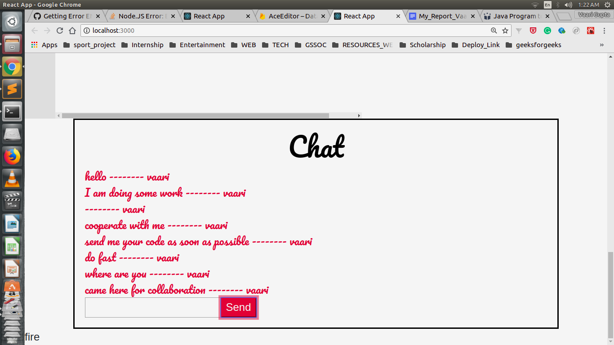

# Collaborative Editor

## Problem
- Working in collaboration on a project by remotely located teammates is not as easy as we think .
- A lot of pitfalls arises at the doorstep for  completion of the project .
- It’s difficult to see other person’s contribution in the project  
- The work is not in Real Time
- For working in collaboration, every programmer’s first choice is  to go for any version control system like GIT , VCS , SVN  and push their code upon them .
- The major  shortcoming is that it’s not in real time that we are concerned for .

## Solution
Here , I have tried to resolve this issue by making entire work to be done in real time .

## I’m emphasizing on  :-
- Collaboration of all remotely located team members in sync  
- Can a easily contribute to the project
- Real time implementation

## About the project

- I have developed  an ONLINE COLLABORATIVE ACE EDITOR  for PROGRAMMING LANGUAGES .
- Basically ,It comprises of two components :-
   - A JAVA CODE EDITOR
   - A CHATBOX to send messages

# First Component - (EDITOR)

# Second Component - (Chat Box)

# Real time View

Visit [here](https://aceeditor-f3e88.firebaseapp.com) to get the live view of the project
